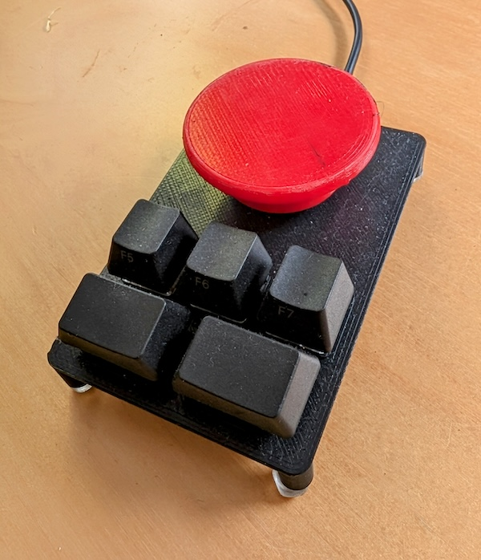
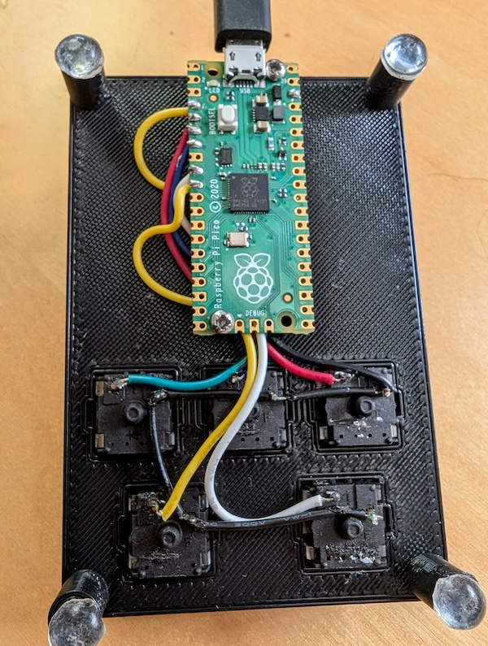

# xmpad - Meeting macropad


Spending too much time in meetings?  Want to exit quickly? Then you need this!



Hit the red to button to exit immediately.  Also has buttons for audio mute and video on/off.

xmpad can be configured to emit custom keypresses for each button - change these to fit your meeting software.  The default maps are:

* Red button: Exit - Ctrl+Alt+F12
* Front left: Audio on/off - Ctrl+Alt+F10
* Front right: Video on/off - Ctrl+Alt+F11
* Middle left: Window switch - Alt+Tab
* Middle centre: Close window - Alt+F4
* Middle right: Enter

I've configured global shortcuts in Zoom for these buttons to avoid clashes with other apps.

xmpad is controlled by a Raspberry Pi Pico connected via USB which appears on your computer as an additonal keyboard.  The key switches are standard MX switches, with MX keycaps.  The big red button is glued on top of a MX keycap.

## Build instructions

### Firmware

The firmware is written in rust.  Install the `thumbv6m-none-eabi` toolchain and compile with:

```
cd firmware
cargo build --release
```

Then install by plugging in the Pico in boot mode and running:

```
elf2uf2-rs -d target/thumbv6m-none-eabi/release/xmpad
```

### 3D Print

Print the case and button from the files in `case/`

### BOM

* Printed case and button
* Raspberry Pi Pico
* Micro USB cable
* 6x MX compatible key switches
* 6x MX keycaps (2x 1.5U, 4x 1U)
* Wire
* Screws to attach Pico
* 4x rubber feet

### Wiring



* Wire a ground wire across all switches to pin 30 (GND)
* Red button: wire to pin 4 (GPIO2)
* Middle left: wire to pin 5 (GPIO3)
* Middle centre: wire to pin 6 (GPIO4)
* Middle right: wire to pin 7 (GPIO5)
* Front left: wire to pin 9 (GPIO6)
* Front right: wire to pin 10 (GPIO7)
